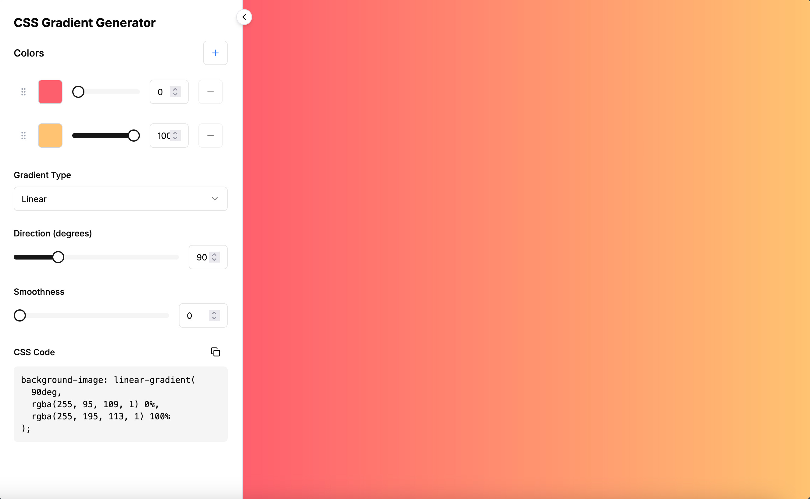

# gradients.defeo.io — CSS Gradient Generator

A sleek, minimal, and customizable CSS Gradient Generator built with [Next.js](https://nextjs.org/), [Tailwind CSS](https://tailwindcss.com/), and [TypeScript](https://www.typescriptlang.org/). Easily create, preview, and copy beautiful gradients for your next web project.

Live demo: [gradients.defeo.io](https://gradients.defeo.io)



---

## Features

- Real-time gradient preview
- Linear, radial, conical, and repeating gradient support
- Color stop editing
- Angle and direction adjustment
- One-click CSS copy

---

## Getting Started

### 1. Clone the repo

```bash
git clone https://github.com/mdefeo/gradients.defeo.io.git
cd gradients.defeo.io
```

### 2. Install dependencies

```bash
pnpm install
```

Or use yarn install or npm install depending on your preference.

### 3. Run the development server

```bash
pnpm dev
```

Visit [http://localhost:3000](http://localhost:3000) to view it in the browser.
